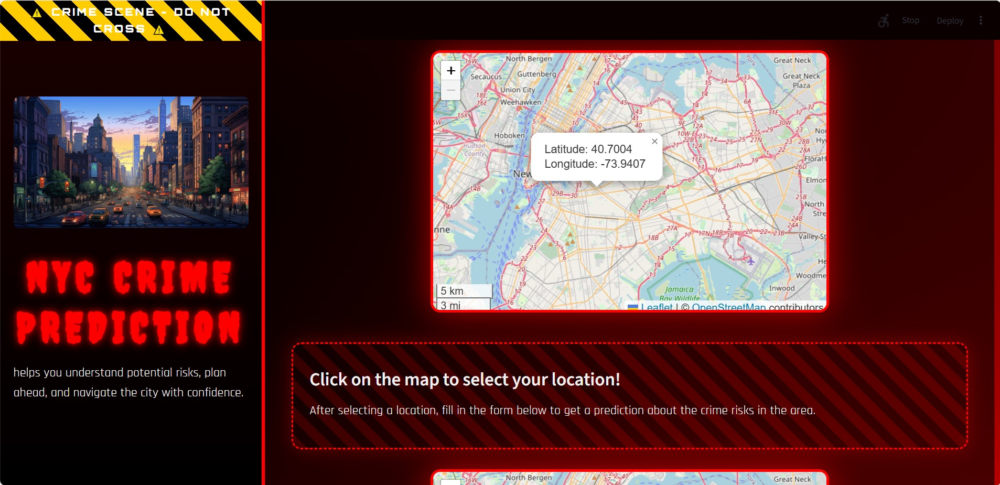
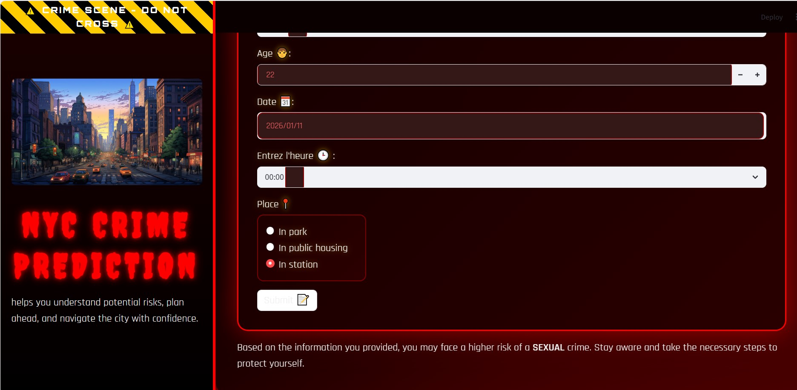

# New York City Crime Detection 
<div align="center">
  <h4>
    <a href="#overview">Overview</a> |
    <a href="#dataset">Dataset</a> |
    <a href="#notebooks">Notebooks</a> |
    <a href="#technologies">Technologies</a> |
    <a href="#installation">Installation</a> |
    <a href="#usage">Usage</a> |
    <a href="#user-interface">User Interface</a> |
    <a href="#research-paper">Research Paper</a> |
    <a href="#credits">Credits</a>
  </h4>
</div>


##  Overview

Anticipating crime risks plays a key role in improving public safety.  
This project presents a **machine learning–driven web application** designed to analyze  crime data from **New York City** and estimate the likelihood of crime occurrences.

By combining **temporal** and **spatial** information—such as location and time—with user-provided inputs, the application delivers **actionable insights** to support informed decision-making.

Whether users are planning routes, or simply staying alert to potential risks, this tool promotes a **proactive approach to personal and urban safety**.

---

##  Dataset

The project leverages the **NYPD Complaint Data Current Dataset**, which provides detailed records of reported crimes across New York City.

### Key Characteristics

- **7.8 million** records
- **35 attributes**, including:
  - Temporal features :year, month, day, hour
  - Geospatial  features :latitude, longitude
  - Contextual features:IN PARK, IN PUBLIC HOUSING.
  - Demographic features : age group, race, sex.
  - Crime-related information (offense type)

---

##  Notebooks

### Repository Content

####  Data Cleaning & Exploratory Data Analysis (EDA)
- Initial preprocessing
- Data cleaning
- Exploratory analysis to identify key patterns 

####  Data Preparation & Modeling
- Feature engineering
- Model training
- Evaluation of machine learning algorithms for crime prediction

---

## Technologies

### Web Application

- **Streamlit** – Interactive dashboard development  
- **Folium** – Interactive map visualization  
- **Geopy** – Geocoding services  
- **GeoPandas** – Spatial data processing  
- **Shapely** – Geometric operations  

###  Data Processing & Machine Learning

- **Pandas** – Data manipulation  
- **Seaborn & Matplotlib** – Data visualization  
- **Scikit-learn** – Machine learning framework  
- **LightGBM, XGBoost, CatBoost** – Gradient boosting models  

---

## Installation

### Step 1: Create a Virtual Environment

```bash
python -m venv venv
source venv/bin/activate   # macOS/Linux
venv\Scripts\activate      # Windows
```

### Step 2: Install Dependencies

```bash
cd application
pip install -r requirements.txt
```

---

## Usage**

### Step 1: Clone the Repository

```bash
git clone https://github.com/your-repo/nyc-crime-detection.git
cd NYC_Crime_Prediction
```

### Step 2: Start the Application

```bash
cd application
streamlit run main.py
```

### Step 3: Access the Application

Open your browser and navigate to:

```
http://localhost:8501
```

---

## **User Interface**

###  **Interactive Dashboard**

Overview of the main dashboard and its features


---

### **Map Selection & Predictions**

Select your location on an interactive map 



---

###  **Form Input & Results**

Fill in your details and View crime risk predictions with detailed insights:



---

##  **Research Paper**

A comprehensive explanation of the methodology, experiments, and findings is available in the accompanying research paper.

---

##  **Credits**

This project was developed by:

- **Ahmed Guermazi**
- **Emna Belguith**
- **Fatma Abid**
- **Rimel Hammami**
